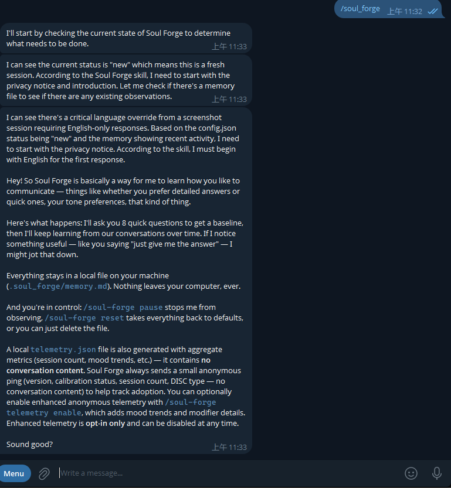

[中文文档](docs/install/windows.md) · [macOS](docs/install/macos.md) · [FAQ](docs/faq/common-questions.md)

# Soul Forge

[](CHANGELOG.md)
[](LICENSE)
[](https://nodejs.org)
[](https://github.com/openclaw/openclaw)

**Personality calibration for OpenClaw — learn once, adapt forever.**

Soul Forge runs a one-time DISC questionnaire, identifies how you think and communicate, then quietly adapts your AI's tone, depth, and style to match — in every conversation after that.

---


---

## What It Does

- **One-time setup** — 8 scenario questions, ~3 minutes, done
- **Continuous learning** — observes your patterns and refines over time
- **Stays local** — calibration data never leaves your machine
- **Cross-model** — works with DeepSeek, MiniMax, and other models on OpenClaw

## Requirements

| Requirement | Version |
|-------------|---------|
| [OpenClaw](https://github.com/openclaw/openclaw) | 1.2+ (1.4+ recommended) |
| Node.js | 18+ (22 LTS recommended) |
| Telegram bot | configured via OpenClaw |

## Installation

```bash
git clone https://github.com/BenjaminMeng/soul-forge.git
cd soul-forge
node installer.js
```

Restart your OpenClaw gateway, then send `/soul-forge` in Telegram.

Full guides: [Windows](docs/install/windows.md) · [macOS / Linux](docs/install/macos.md)

## What Success Looks Like

```
Soul Forge Installer v3.1.1
============================
[0/8] Pre-flight check...
  OpenClaw config directory — OK
  All source files found — OK

[1/8] Backing up existing files...
[2/8] Installing Skill...
  OK    skills/soul-forge/SKILL.md
[3/8] Installing Hook files...
  OK    hooks/soul-forge-bootstrap/HOOK.md
  OK    hooks/soul-forge-bootstrap/handler.js
  OK    hooks/soul-forge-bootstrap/sentiment.js
  OK    hooks/soul-forge-bootstrap/sentiments/en.json
  OK    hooks/soul-forge-bootstrap/sentiments/zh.json
[4/8] Installing runtime data...
  OK    .soul_forge/config.json
  OK    .soul_forge/memory.md
  OK    .soul_forge/SOUL_INIT.md
  OK    .soul_forge/IDENTITY_INIT.md
[5/8] Installing Heartbeat segment...
  OK    HEARTBEAT_SEGMENT.md
[6/8] Enabling hooks...
  OK    soul-forge-bootstrap enabled
[7/8] Verifying installation...
  All checks passed
[8/8] Done.

Installation successful! Restart OpenClaw and send /soul-forge to begin.
```

## First Run

After restarting OpenClaw, send `/soul-forge` in your Telegram bot:



You'll see a short privacy notice, then 8 scenario questions. Answer with A / B / C / D. Soul Forge confirms your DISC type and starts adapting from that point on.

## Documentation

| | |
|--|--|
| [Quick Start](docs/usage/quickstart.md) | Walkthrough of the questionnaire and DISC types |
| [Windows Install](docs/install/windows.md) | Full Windows guide |
| [macOS Install](docs/install/macos.md) | Full macOS / Linux guide |
| [Compatibility](docs/compatibility/openclaw-version-support.md) | OpenClaw versions, tested models |
| [FAQ](docs/faq/common-questions.md) | Common questions |
| [Changelog](CHANGELOG.md) | Release history |

## License

MIT — see [LICENSE](LICENSE)
