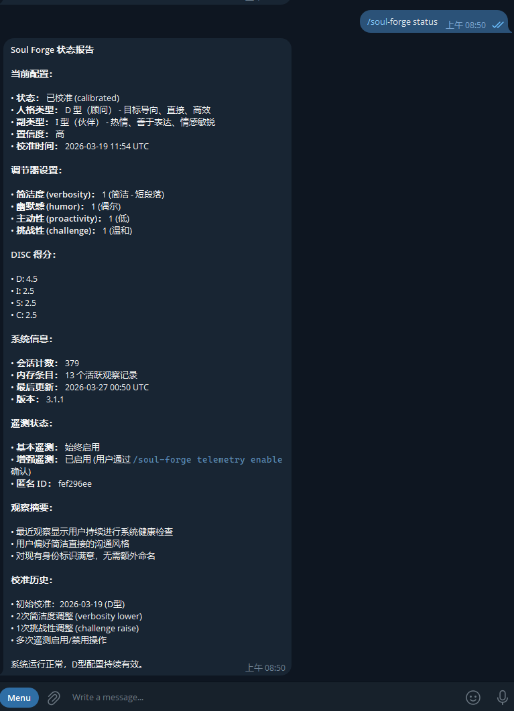

# Soul Forge Windows 安装指南

## 前提条件

确保已安装：

1. **Node.js 18+** (推荐 22 LTS) — https://nodejs.org/（下载 Windows Installer，64-bit LTS）
   ```powershell
   node -v   # 应该显示 v18.x.x 或更高（推荐 v22.x.x）
   ```

2. **Git for Windows** — https://git-scm.com/download/win
   ```powershell
   git --version
   ```

---

## 第一步：安装 OpenClaw（如果还没装）

OpenClaw 有两种安装方式，选一种：

### 方式 A：npm 直装（推荐）

以管理员身份打开 PowerShell：

```powershell
# 1. 全局安装 OpenClaw
npm install -g openclaw@latest

# 2. 运行初始化向导
openclaw onboard --install-daemon

# 3. 启动网关
openclaw gateway --port 18789

# 4. 打开浏览器访问 http://127.0.0.1:18789/
#    把终端显示的 token 粘贴到 Control UI 设置里
```

### 方式 B：Docker Desktop

```powershell
git clone https://github.com/openclaw/openclaw.git
cd openclaw
$env:OPENCLAW_IMAGE = "ghcr.io/openclaw/openclaw:latest"
./docker-setup.ps1
```

### 配置 Telegram Bot（两种方式通用）

```powershell
# 1. 在 Telegram 里找 @BotFather
# 2. 发送 /newbot，按提示创建一个 bot
# 3. 你会得到一个 token，格式类似：123456789:ABCdefGHIjklMNOpqrsTUVwxyz

# 4. 添加频道
#    npm 方式：
openclaw channels add --channel telegram --token "你的BOT_TOKEN"

#    Docker 方式：
docker compose run --rm openclaw-cli channels add --channel telegram --token "你的BOT_TOKEN"
```

### 验证 OpenClaw 正常运行

```powershell
# 检查健康状态
Invoke-RestMethod http://127.0.0.1:18789/healthz

# 在 Telegram 里给你的 bot 发一条消息，看是否有回复
```

---

## 第二步：安装 Soul Forge

OpenClaw 运行正常后：

```powershell
# 1. 克隆 Soul Forge
git clone https://github.com/BenjaminMeng/soul-forge.git
cd soul-forge

# 2. 运行安装器
node installer.js

# 3. 重启 OpenClaw

#    npm 方式：
openclaw gateway restart
#    或 Ctrl+C 停止，再运行 openclaw gateway --port 18789

#    Docker 方式：
docker compose down
docker compose up -d
```

### 验证安装成功

安装器输出应全是 `OK`：
```
  OK    Skill SKILL.md (xxxxx bytes)
  OK    Hook HOOK.md (xxx bytes)
  OK    Hook handler.js (xxxxx bytes)
  ...
  Installation successful!
```

然后在 Telegram 给你的 bot 发送：

```
/soul-forge
```

看到隐私说明和问卷提示，安装成功：


发送 `/soul-forge status` 可以随时查看当前校准状态：



---

## 常见问题

### Q: `node installer.js` 报错 "OpenClaw config not found"
A: 检查 OpenClaw 配置目录是否存在：
```powershell
ls $env:USERPROFILE\.openclaw\
```
不存在则重新运行 `openclaw onboard --install-daemon`。

### Q: npm 全局安装报权限错误
A: 以管理员身份重新打开 PowerShell，再运行安装命令。

### Q: Node.js 版本太低
A: 去 https://nodejs.org/ 下载最新 LTS 版本重新安装（最低 18，推荐 22）。

### Q: 重启后 bot 没反应
A: 确认网关在运行：
```powershell
# npm 方式
openclaw gateway probe

# Docker 方式
docker compose ps
```

### Q: Windows Defender 拦截了脚本
A: Soul Forge 安装器是纯 Node.js，不是 PowerShell 脚本，无需修改执行策略。如果 Defender 拦截 `node installer.js`，可以临时关闭实时保护，安装完成后重新开启。

---

## 安装完成后

1. 在 Telegram 发送 `/soul-forge` 开始人格校准
2. 回答 8 个场景问题（中英双语）
3. 确认你的 DISC 类型
4. 之后正常聊天，Soul Forge 会在后台持续学习和优化
